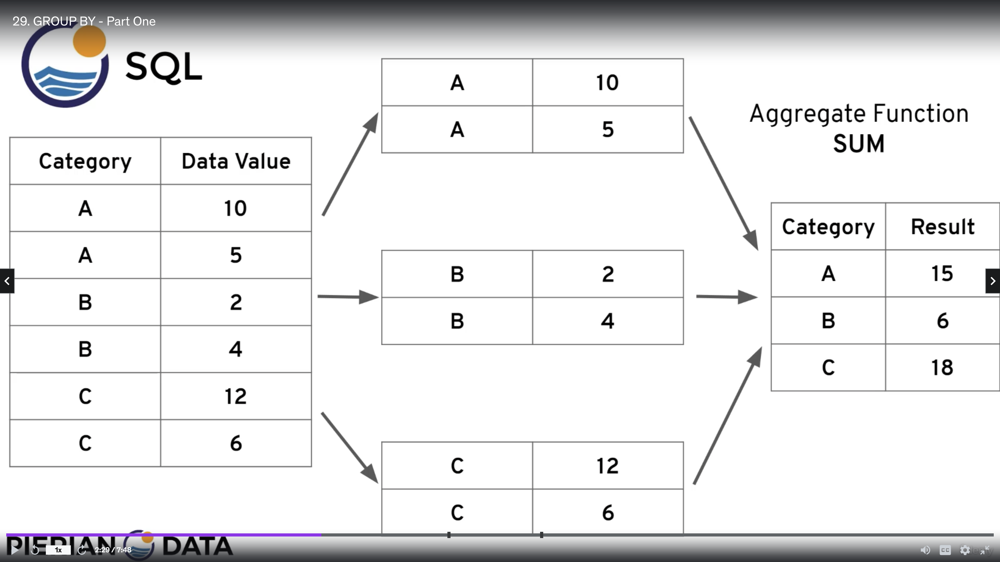
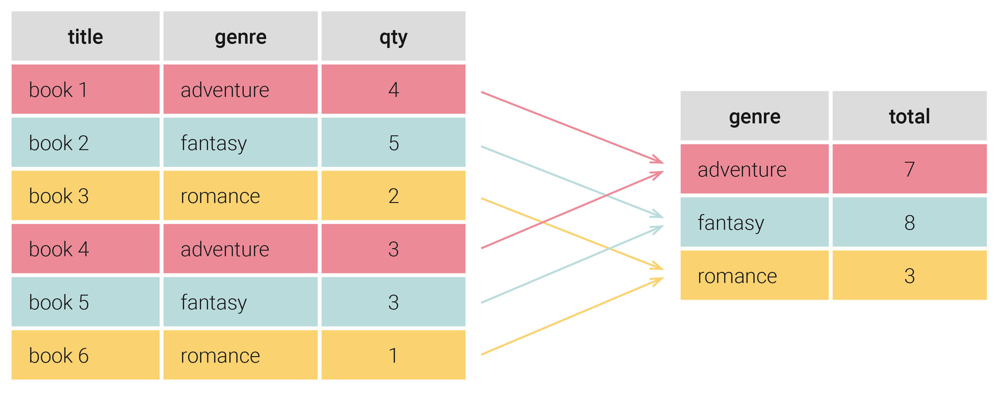

# Data-Management-Self-Study-Journey

Based on The Complete Sql Bootcamp on Udemy

- [Data-Management-Self-Study-Journey](#data-management-self-study-journey)
  - [SQL Fundamentals](#sql-fundamentals)
    - [Distinct, no duplicate value in a column](#distinct-no-duplicate-value-in-a-column)
    - [COUNT, return number of row of column](#count-return-number-of-row-of-column)
    - [WHERE, condition](#where-condition)
    - [ORDER BY](#order-by)
    - [LIMIT, select certain limit number of row](#limit-select-certain-limit-number-of-row)
    - [BETWEEN, NOT BETWEEN](#between-not-between)
    - [IN, NOT IN](#in-not-in)
    - [LIKE and ILIKE](#like-and-ilike)
  - [GROUP BY](#group-by)
    - [Aggregate Functions](#aggregate-functions)
    - [GROUP BY](#group-by-1)
    - [HAVING](#having)
  - [Database Foundations](#database-foundations)
    - [Relational database](#relational-database)
    - [keys and unque values](#keys-and-unque-values)
    - [Relationships](#relationships)
    - [ACID and transactions](#acid-and-transactions)
    - [basic sql](#basic-sql)

## SQL Fundamentals 

SELECT column FROM table

### Distinct, no duplicate value in a column

SELECT DISTINCT column FROM table

to clarify which column applied to 

SELECT DISTINCT(column) FROM table

### COUNT, return number of row of column

SELECT COUNT(name) FROM table

SELECT COUNT(DISTINCT name) FROM table;

### WHERE, condition

SELECT name,choice FROM table WHERE name = 'David' AND choice = 'red'

### ORDER BY

SELECT company, name, sales FROM table ORDER BY company ASC, sales DESC

default ASC

multiple, the second column sorting **within duplicate entries** of the first column

### LIMIT, select certain limit number of row

SELECT * FROM payment 
ORDER BY payment_date DESC
LIMIT 5;

### BETWEEN, NOT BETWEEN

the same as

value >= low AND value <= high
value BETWEEN low AND high

include boundary

value < low OR value > high
value NOT BETWEEN low AND high

dates
YYYY-MM-DD

BETWEEN 2000-02-18 AND 2000-02-20
include any time between 02-18 00:00:00 and 02-20 00:00:00

### IN, NOT IN

include or not include the ( , , )

### LIKE and ILIKE

LIKE is case-sensitive, ILIKE is case-insensitive

using pattern matching

replace the rest with % (can be nothing)

all names that begin with an 'A' or end with 'a'

WHERE name LIKE 'A%'

WHERE name LIKE '%a'

replace just a single character with underscore _

get all Mission Impossible Films

WHERE title LIKE 'Mission Impossible _'

Can use multiple underscores 

WHERE value LIKE 'version#__'

also can work with NOT LIKE or NOT ILIKE

## GROUP BY

### Aggregate Functions

take multiple inputs and return a single output

AVG(), COUNT(), MAX(), MIN(), SUM()

happen only in SELECT or HAVING clause

Special notes

* AVG() only returns a floating point value, use ROUND() to specify precision after the decimal

* Convention: just use COUNT(*)

SELECT MAX(replacement_cost) FROM film;

SELECT ROUND(AVG(replacement_cost),2) FROM film;

### GROUP BY

1. choose categorical column

2. not continuous

3. can be numeric

SELECT category_col, AGG(data_col) FROM table

WHERE category_col != 'A'

GROUP BY category_col

description: how many/ what is AGG() per category_col per category_col_1 ...

* the GROUP BY clause must appear right after FROM statement or WHERE statement

* in the SELECT statement, columns must either have an aggregate function or be in the GROUP BY call

* WHERE statement should not refer to the aggregation result, it filter before GROUP BY, HAVING is used to filter result.

ORDER BY AGG(data_col)

* used after GROUP BY, (same as LIMIT)

* sort results based on the aggregate, refer to the entire function

SELECT customer_id, COUNT(amount), SUM(amount) FROM payment

GROUP BY customer_id

ORDER BY COUNT(amount), SUM(amount) DESC

SELECT staff_id, customer_id, SUM(amount) FROM payment

GROUP BY staff_id, customer_id

ORDER BY SUM(amount) DESC

* mostly SELECT columns has the same order as GROUP BY columns

* ORDER BY determined by question

GROUP BY data and time

DATE(payment_date) extract date info

SELECT DATE(payment_date), SUM(amount) FROM payment

GROUP BY DATE(payment_date)

ORDER BY SUM(amount) DESC

SELECT staff_id, COUNT(*) FROM payment

GROUP BY staff_id

ORDER BY COUNT(*) DESC

SELECT rating, ROUND(AVG(replacement_cost),2) FROM film

GROUP BY rating

ORDER BY ROUND(AVG(replacement_cost),2) DESC

SELECT customer_id, SUM(amount) FROM payment

GROUP BY customer_id

ORDER BY SUM(amount) DESC

LIMIT 5

### HAVING

AGG() not gonna happen until call GROUP BY

SELECT company, SUM(sales) FROM finance_table

GROUP BY company

HAVING SUM(sales) > 100

SELECT customer_id, SUM(amount) FROM payment

GROUP BY customer_id

HAVING SUM(amount) > 100

SELECT customer_id, staff_id, SUM(amount) FROM payment

WHERE staff_id = 2

GROUP BY customer_id, staff_id

HAVING SUM(amount) > 100;

## Database Foundations

### Relational database

rows: instances of a given entity

columns: attributes of each entity

table are made of rows, which present instances of a given entity

and columns, which represent attributes of each entity

the set of columns is called a relation

customer = entity

each individual customer = an instance of a customer

customers share common attributes, but their data of attributeis are different from each other

### keys and unque values

unique value can be used as keys 

key is the value that we can use to refer to only one specific row or record

**primary key:**

a primary key is the most important key in a table, they can be others as well

we can do this by adding a column to a table, and setting that column to require a uniqle value.

**composite key:**

if may not be able to modify a table, we may use two or more field in the data to act as a key

two or more field taken together to act as a uniqle identifier

**foreign key:**

this is what a primary key from one tables is called when it is referenced in another table

that is important when we start to build relationships between tables to associate one record with others

### Relationships

one to many 

this associates one records in one table with multiple records in another table

many to many

creating a linking table, that contains column for the foreign key from the table we are associating 

used to keep record of each dish that each customer has ordered 

one to one

associate only one record in one table with only one record in another table

such that the targeted record cannot be associated with another record at the same time

### ACID and transactions

Transactions is a set of operations that must be all completed

and if for some reason, any of the individual operations are not completed

no changes are made to the database, anything that partially done will be undone

ACID principle

atomic: the transaction is indivisible, that pieces of it cannot be separated out.

consistent: whatever the transaction does, it needs to leave the database in valid and consistent state

isolated: while the activities in the transaction are being completed, nothing else can make changes to the data involved 

durable: the information we change in the transaction actually get written to the database

when the transaction is reported as complete, the data is there, the change has been made, 

tell the system when code that we are doing transaction

### basic sql

interact with data 

creating or modifying tables, and controlling access to tables

statements called queries

clause = expression + predicates + key word

expression + predicates set parameters within which to operate

SELECT field_name_1, field_name_2 FROM table_name;

create, read, update and delete are called CRUD

